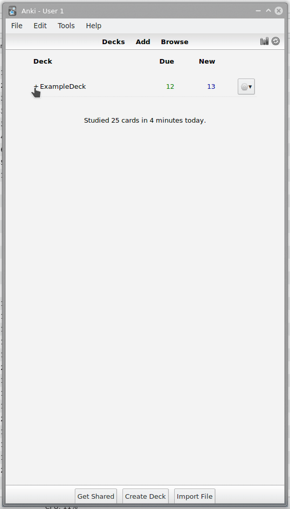

# AnkiDeckGenerator

Convert a list of Chinese characters/words/sentences and/or English words/sentences into an extremely powerful Anki Deck Package (apkg).
Note: This project is still in beta at the moment.

# Screenshots


## TODO
- [x] Make some changes to pepebecker's pinyin-split project so we can use it in the templates to properly split multi-syllable hanzi words.
- [ ] Transpile pinyin-split to ES5 and add it to the templates
- [x] Create a Stroke order diagram generator that outputs still images with numbers
- [x] and create a Pull Request at https://github.com/skishore/makemeahanzi adding this generator script and the generated stroke diagrams
- [ ] Create another Pull Request for makemeahanzi with the latest generator script changes.
- [ ] Make popup work on Windows
- [x] Make popup work on Linux
- [x] Make popup work on Android
- [x] Accept individual Chinese characters as input
- [x] Accept Chinese words consisting of multiple characters as input
- [x] Accept Chinese sentences consisting of multiple character as input
- [x] Create a highly dynamic and configurable input file format
- [ ] Fill missing data (hanzi, pinyin, audio) when only specifying English words/sentences as input
- [x] Generate Anki card data for the Hanzi
- [x] Generate Anki card data for the English translation
- [x] Generate Anki card data for example words that contain a given cards Hanzi
- [x] Generate Anki card data for the english translation of the example words
- [x] Generate Anki card data for example sentences that contain a given cards Hanzi
- [x] Generate Anki card data for the english translation of the example sentences
- [x] Add multiple audio files for the pronunciation of the used Hanzi for every context
- [x] Generate Anki card data for the Pinyin
- [x] Generate Anki card data for the Hanzi decomposition
- [x] Generate Anki card data for the Hanzi type (ideographic/pictographic/pictophonetic)
- [x] Generate Anki card data for the Hanzi formation in case of ideographic/pictographic
- [x] Generate Anki card data for the semantic/phonetic Hanzi etymology in case of pictophonetic
- [x] Generate Anki card data for the primary radical of the Hanzi
- [x] Generate Anki card data for the charCode as used in JavaScript
- [x] Generate Anki card data for the charCode as used in JavaScript
- [x] Copy the Hanzi stroke order diagrams into the deck output
- [x] Write a bootstrap based Anki card template that uses all the features mentioned above
- [x] Allow specifiying an output dir for the generated files
- [x] Write Anki card data in Anki compatible tsv format as output
- [ ] Document all features
- [ ] Clean up for initial release
- [ ] Add screenshots

## Requirements
- git
- nodejs (at least v10)

## Installation
```
git clone --recursive https://github.com/FOSS-Chinese/AnkiDeckGenerator.git
cd AnkiDeckGenerator
npm i
cd submodules/makemeahanzi/stroke_caps
node generateStillSvgs.js
```

## Example Usage
Create an input file. (Take the [example-input.txt](example-input.txt) as an example.)
Then run the following command:
```
node index.js auto-generate -i example-input.txt -n ExampleDeck -d MyDeckDescription ExampleDeck.apkg
```
Or just run `npm run example`.

## Usage
(Note: Some of these options have not been tested yet.)
```
  Usage: node ./index.js auto-generate [options] <apkg-output-file>

  Options:

    -i, --input-file [file-path]                             File containing a json-array of Chinese characters, words and/or sentences.
    -c, --clear-apkg-temp [boolean]                          Automatically clear the apkg temp folder after creating the apkg. Default: true
    -n, --deck-name <string>                                 Name of the deck to be created
    -d, --deck-description <string>                          Description of the deck to be created
    -t, --temp-folder [folder-path]                          Folder to be used/created for temporary files
    -l, --libs-folder [folder-path]                          Folder holding libraries for template
    -a, --audio-recordings-limit [integer]                   Max amount of audio recordings to download for each character, word and sentence. (-1: all, 0: none, 1: one, 2: two) Default: 1
    -r, --big-dict [boolean]                                 Include all hanzi chars in the deck-internal dictionary. (Use only if you want to add cards later on without the generator.) Default: false
    -r, --recursive-media [boolean]                          Download media not only for input file entries, but also for every single word, character and component found in each entry. Default: true
    -r, --recursive-cards [boolean]                          Add cards not only for input file entries, but also for every single word, character and component found in each entry. Default: false
    -p, --dictionary-priority-list [comma-separated-string]  List of dictionaries (offline and online) to gather data from. (highest priority first. Default: makemeahanzi,mdbg,forvo,archchinese)
    -h, --help                                               output usage information                         output usage information
```

# Donate

